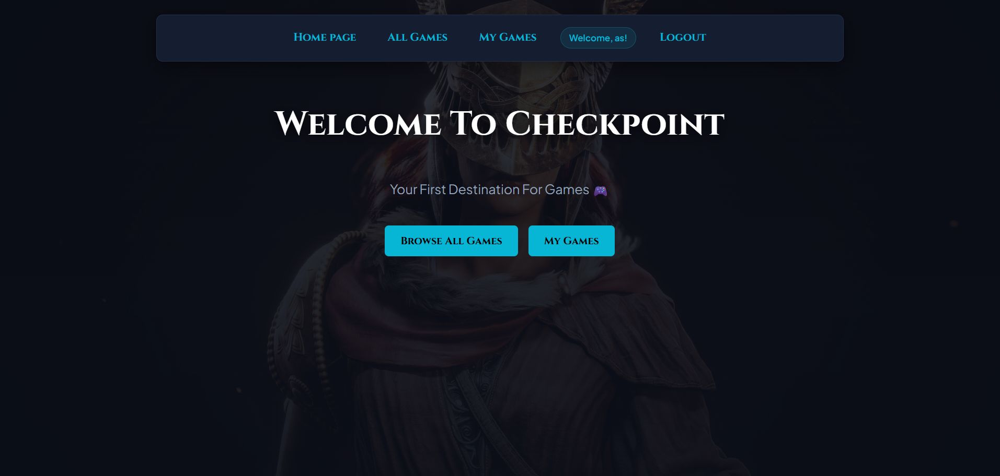
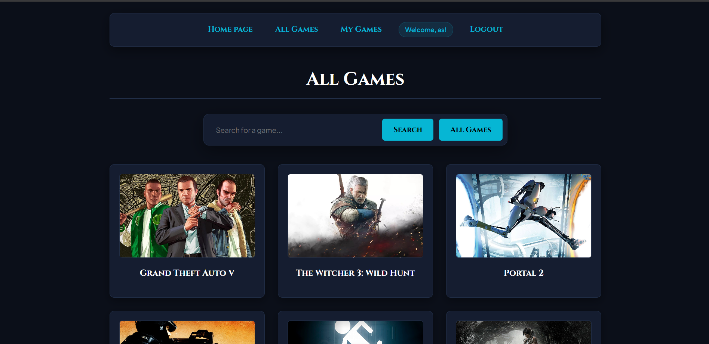
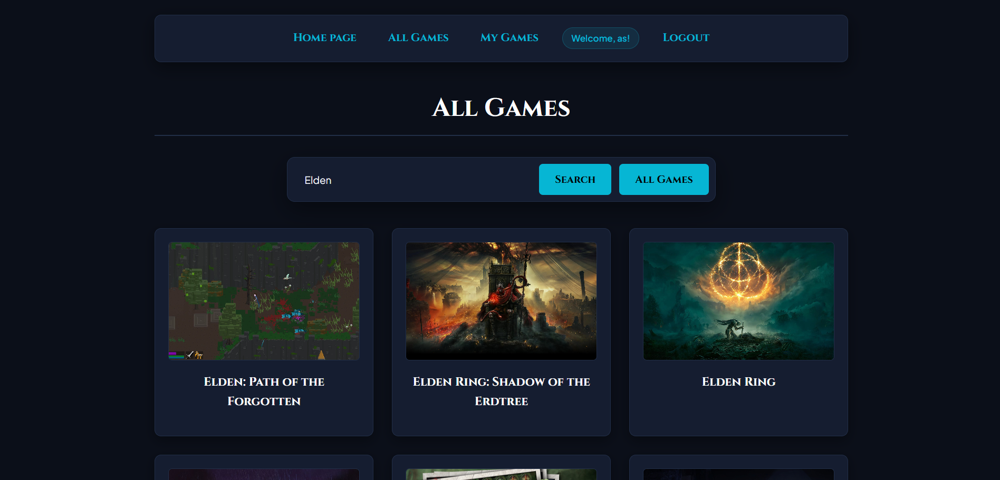
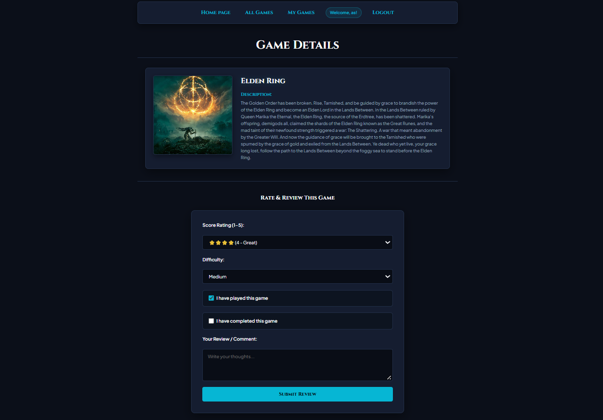
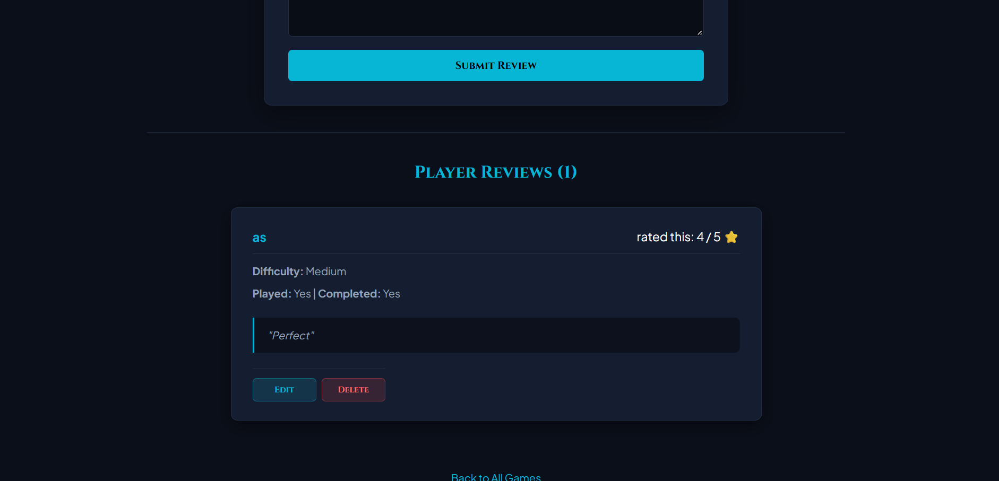
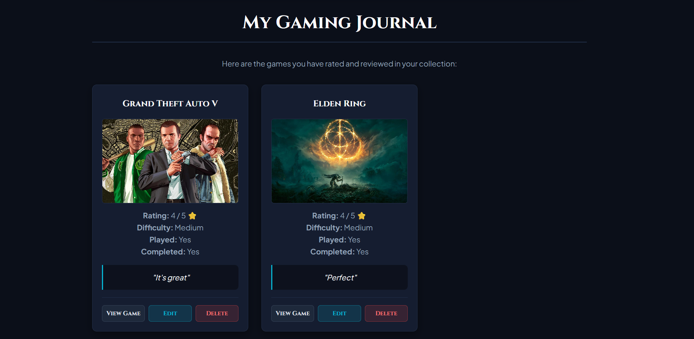
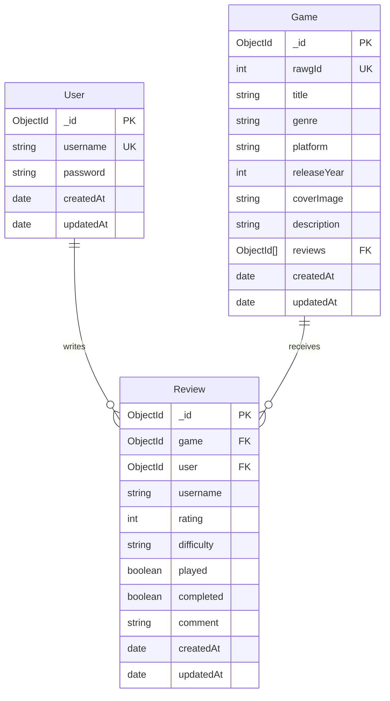

# Checkpoint 🎮

A web application that allows gamers to discover, rate, review, and track their personal video game collection.

---

## Overview

**Checkpoint** lets users create accounts, explore a vast catalog of popular and trending video games powered by the RAWG Video Games Database API, search for any game title in real-time, view in-depth details, and submit personal ratings and reviews. 

Users can track their gameplay journey by logging whether they have played or completed a title, assigning a 1–5 star rating, picking a difficulty tier (Easy, Medium, Hard, Nightmare), and writing custom reviews. Gamers also get their own personal **Gaming Journal** ("My Games") to manage and revisit all their logged games with full CRUD capabilities (Create, Read, Update, Delete).

---

## Screenshots

### Homepage

### All Games & Search Catalog
 

### Game Details & Review Form


### My Gaming Journal

---

## Technologies Used

### Backend
Node.js
Express.js
MongoDB and Mongoose
express-session with connect-mongo (sessions stored in MongoDB)
bcrypt (password hashing)
method-override, morgan, dotenv

### Frontend
EJS
Bootstrap 5 and Bootstrap Icons
Custom CSS
Inter (Google Fonts)
---

## Getting Started

Follow these steps to run the project locally.

### 1. Clone the Repository
```bash
git clone https://github.com/S3lii/Project2-Checkpoint.git
```
Then move into the project folder:
```bash
cd Project2-Checkpoint
```

### 2. Install Dependencies
```bash
npm install
```

### 3. Set Up Environment Variables
Create a `.env` file in the root directory of the project and add:
```env
PORT=3000
MONGODB_URI=your_mongodb_connection_string
SESSION_SECRET=your_session_secret
RAWG_API_KEY=your_rawg_api_key
```

> **Important:** Never upload your `.env` file to GitHub. Ensure it is listed in `.gitignore`.

*(A free RAWG API key can be obtained by signing up at [RAWG API](https://rawg.io/apidocs).)*

### 4. Start the Application
With nodemon (development mode):
```bash
npm run dev
```
Or with standard node:
```bash
npm start
```

### 5. Open the Application
Once the server is running, open your browser and navigate to:
```
http://localhost:3000
```
The **Checkpoint** application should now be live!

---

## Requirements

Before running the project, make sure you have:
- [Node.js](https://nodejs.org/) installed (v18+ recommended)
- [npm](https://www.npmjs.com/) installed
- A MongoDB database (local MongoDB or [MongoDB Atlas](https://www.mongodb.com/atlas))
- [Git](https://git-scm.com/) installed
- A [RAWG API](https://rawg.io/apidocs) key

---

## Project Structure


---

## User Stories

- **As a visitor**, I want to view the homepage and browse all games so that I can explore popular and trending titles.
- **As a visitor**, I want to search for games by title so that I can find specific games quickly.
- **As a visitor**, I want to create an account and sign in securely so that I can track my personal game collection.
- **As a user**, I want to view detailed information about any game, including its cover art, title, description, and community reviews.
- **As a signed-in user**, I want to submit a review with a score rating (1–5 ⭐), difficulty level (Easy, Medium, Hard, Nightmare), played status, completed status, and personal thoughts.
- **As a signed-in user**, I want to view my personal gaming journal ("My Games") to see all games I have rated and logged.
- **As a review author**, I want to edit my existing reviews to update my rating, difficulty, status, or comment.
- **As a review author**, I want to delete my review with a confirmation prompt so that it is removed from the game and my journal.
- **As a user**, I want to sign out securely when I am finished using the application.

---

## Database Design



---

## Routes

### Index
| Method | Route | Description |
| :--- | :--- | :--- |
| **GET** | `/` | Render homepage hero |

### Auth
| Method | Route | Description |
| :--- | :--- | :--- |
| **GET** | `/auth/sign-up` | Render sign-up form |
| **POST** | `/auth/sign-up` | Create a new user with hashed password |
| **GET** | `/auth/sign-in` | Render sign-in form |
| **POST** | `/auth/sign-in` | Authenticate user and initialize session |
| **GET** | `/auth/sign-out` | Destroy session and sign out |

### Games & Catalog
| Method | Route | Description |
| :--- | :--- | :--- |
| **GET** | `/games` | Browse all games catalog or search by query (`?search=...`) |
| **GET** | `/games/my-games` | View personal gaming journal with logged games (auth required) |
| **GET** | `/games/:gameId` | Display single game details, cover art, and player reviews |

### Reviews CRUD
| Method | Route | Description |
| :--- | :--- | :--- |
| **POST** | `/games/:gameId/reviews` | Submit a new review and rating for a game (auth required) |
| **GET** | `/games/:gameId/reviews/:reviewId/edit` | Render review edit form (auth + owner required) |
| **PUT** | `/games/:gameId/reviews/:reviewId` | Update an existing review (auth + owner required) |
| **DELETE** | `/games/:gameId/reviews/:reviewId` | Delete a review from game and journal (auth + owner required) |

---

## Features

- **User Authentication**: Secure sign-up, sign-in, and sign-out with hashed passwords via `bcrypt`.
- **Persistent Sessions**: Logged-in state saved in MongoDB using `connect-mongo`.
- **Live RAWG API Integration**: Fetches real-time popular video games and live title searches.
- **Database Caching**: Automatically saves fetched RAWG games to MongoDB when reviewed, preserving review history and relations.
- **Full Review CRUD**:
  - **Create**: Add a review with 1–5 stars, 4 difficulty tiers, played/completed checkboxes, and comments.
  - **Read**: View reviews on individual game detail pages and in your personal journal.
  - **Update**: Edit your rating, difficulty, completion status, or written review.
  - **Delete**: Remove your review with a confirmation prompt.
- **Personal Gaming Journal**: Dedicated "My Games" page displaying all user-reviewed games with quick action buttons.
- **Search System**: Real-time game search with clean fallback for empty results.
- **Responsive Dark Gaming Theme**: Custom CSS featuring glassmorphic navigation, elevated dark cards, glowing cyan accents, and mobile-friendly responsive grid layouts.

---

## Future Enhancements

- Backlog / Wishlist
- Custom User Profiles & Avatars
- Filter by Genre & Platform

---

## Credits

- **[RAWG Video Games Database API](https://rawg.io/apidocs)** - Game data and cover imagery
- **[Google Fonts](https://fonts.google.com/)**